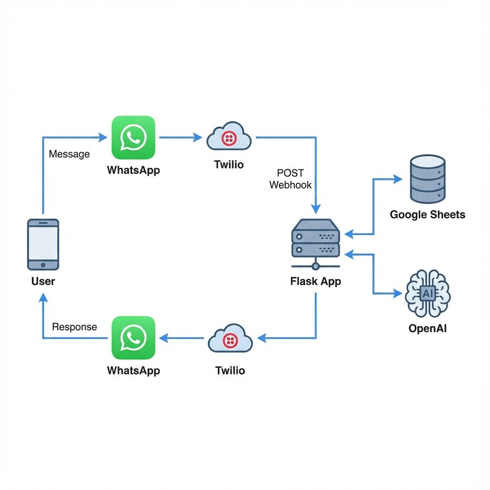
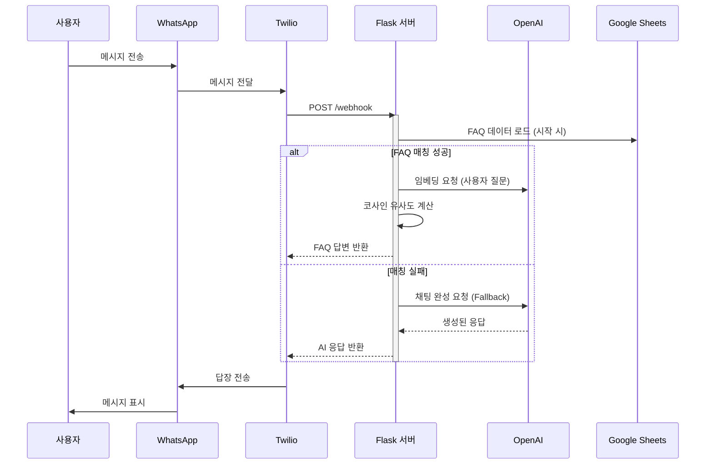

# 시스템 아키텍처 (System Architecture)

## 개요 (Overview)
Smart Campus Assistant는 OpenAI의 지능형 기능과 Google Sheets의 간편한 데이터 관리를 활용하는 왓츠앱(WhatsApp) 기반 챗봇입니다.

## 아키텍처 모식도 (Architecture Diagram)

## 데이터 흐름 (Data Flow)

## 구성 요소 (Components)

1.  **사용자 인터페이스**: WhatsApp (Twilio API 경유).
2.  **백엔드**: Railway에 호스팅된 Flask 애플리케이션.
3.  **AI 엔진**: OpenAI GPT-3.5 (대체 응답) & Embeddings (검색).
4.  **데이터베이스**: Google Sheets (읽기 전용 FAQ 지식 베이스).
